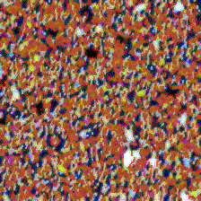
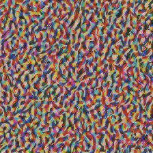
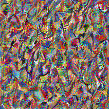
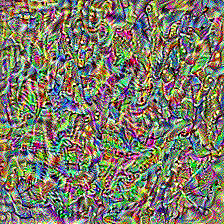
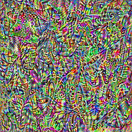
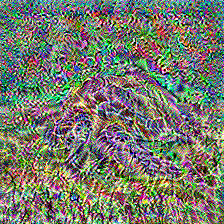
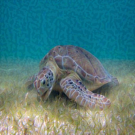
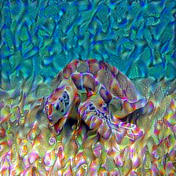
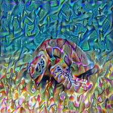

# GSOC2019 TensorFlow js

This website will give you an overview of the work done by me during the Google Summer of Code 2019.

## Model conversion

During this sub-project, I converted multiple Keras models to TensorFlow js models and made them available on GitHub.
Additionally, I wrote a blog post which explains the workflow of converting a python Keras model into a TensorFlow js model.

Dev.to: [https://dev.to/paulsp94/convert-keras-models-to-tfjs-2k3](https://dev.to/paulsp94/convert-keras-models-to-tfjs-2k3)

First I converted the VGG19 model that was pre-trained on the ImageNet dataset. 
This model was then used for the Neural Style Transfer.

GitHub: [https://github.com/paulsp94/tfjs_vgg19_imagenet](https://github.com/paulsp94/tfjs_vgg19_imagenet)

Then I converted the ResNet50 model as an example for the blog post and also as a base for an npm package.

GitHub: [https://github.com/paulsp94/tfjs_resnet_imagenet](https://github.com/paulsp94/tfjs_resnet_imagenet)

## Model as a package

After converting the model into Javascript, I wanted to make it as accessible as possible. So I decided to create an npm package around the model with a classification wrapper, so the developers can just install the package and use the model for classification right away.

Dev.to: [https://dev.to/paulsp94/packing-tfjs-models-into-npm-packages-1d1j](https://dev.to/paulsp94/packing-tfjs-models-into-npm-packages-1d1j)

NPM: [https://www.npmjs.com/package/resnet_imagenet](https://www.npmjs.com/package/resnet_imagenet)

## Skin Cancer Prediction

For the skin cancer prediction, I started with a Kaggle notebook, where I changed the model to the MobileNetV2 model.
Then I trained the model on Kaggle and exported it into an hdf5 file. 
This file I converted to a TensorFlow js model like in the first section.
Then I packed it into an npm package for easier use, and to give other people the opportunity to include it in their applications.

GitHub: [https://github.com/paulsp94/mobilenetv2skincancer](https://github.com/paulsp94/mobilenetv2skincancer)

NPM: [https://www.npmjs.com/package/mobilenetv2skincancer](https://www.npmjs.com/package/mobilenetv2skincancer)

## Style Transfer

I also worked on the [neural style transfer](https://arxiv.org/pdf/1508.06576.pdf) using the VGG19 model I converted before.
The whole concept is implemented, from the image loading and writing to the style extraction, including gram feature transformation, and content extraction. Also, the style-, content-, and total-variation-loss are working. The VGG19 also needed to be restructured to fit the necessary conditions. I cut off the prediction layer at the end and defined multiple convolutional layers as outputs for the style and one convolutional layer as output for the content.

GitHub: [https://github.com/paulsp94/tfjs_style_transfer](https://github.com/paulsp94/tfjs_style_transfer)

Below you can see the extracted styles from the first convolutional block to the last, and the last image is the extracted content from the last convolutional block.

Some of the results are shown below, but in my opinion, the project is still not working, as the style is not properly transferred.
From the first iteration on the left, over the 50th iteration to the 100th iteration. At 1000 iterations the picture was mostly completely pixelated.

